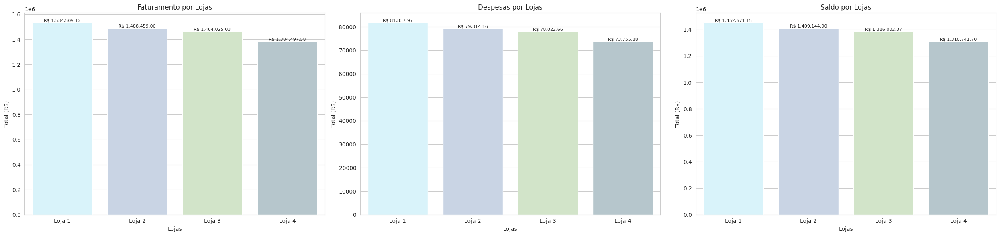
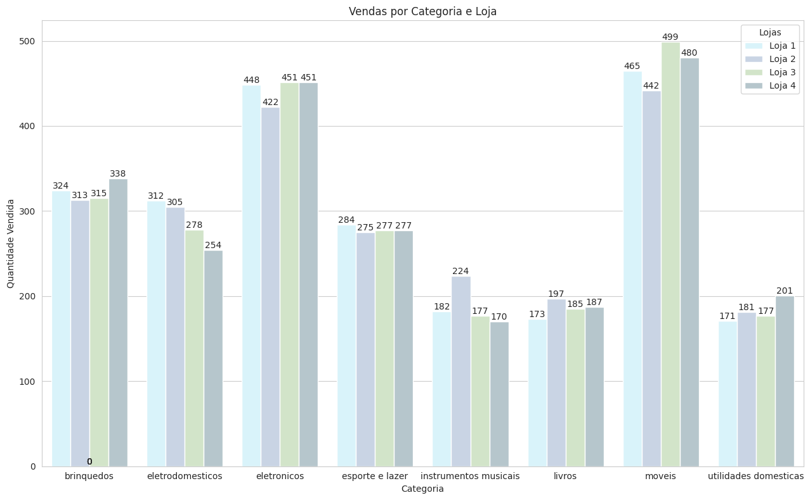
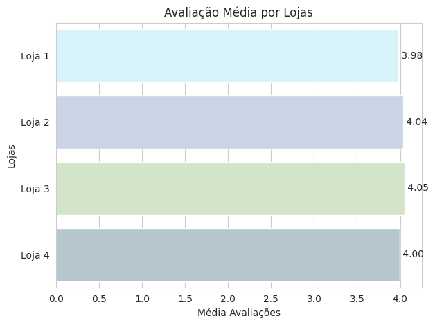
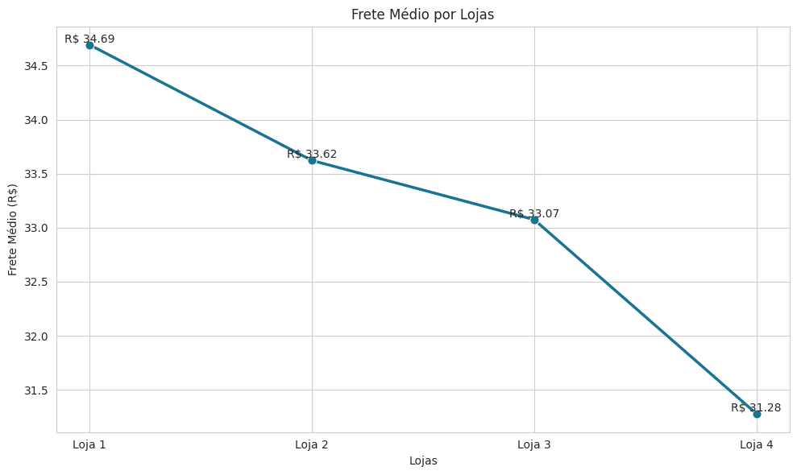
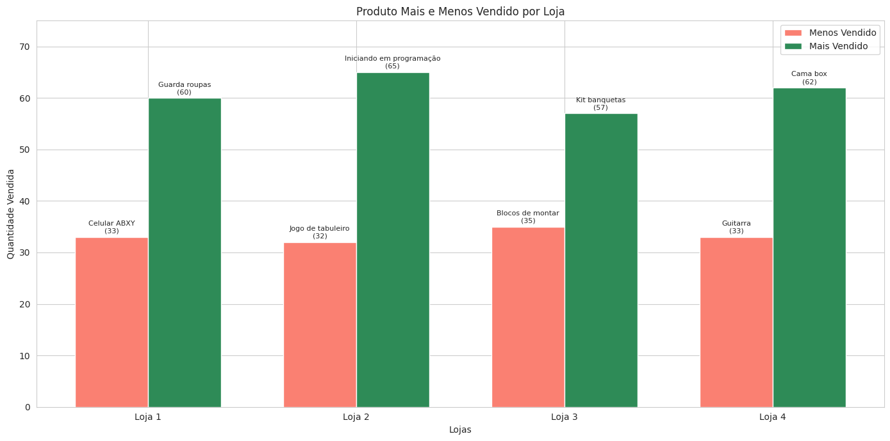
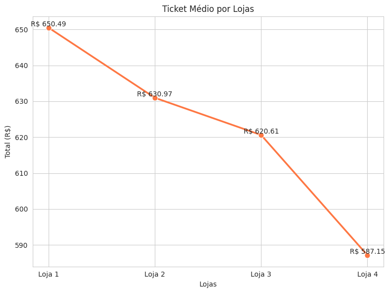

# 📊 Análise de Desempenho das Lojas - Alura Store

<h2> 📋 Sobre o Projeto </h2>
Este projeto tem como objetivo analisar o desempenho de quatro lojas da rede Alura Store para apoiar a decisão estratégica do proprietário, Senhor João, sobre qual loja vender para iniciar um novo empreendimento.

A análise foi baseada em dados reais de vendas, fretes, avaliações e categorias de produtos, utilizando Python e bibliotecas de análise de dados e visualização como Pandas, Matplotlib e Seaborn.

<h2 > 🛠️ Ferramentas Utilizadas </h2>
- Python 3

- Pandas

- Matplotlib

- Seaborn

Jupyter Notebook / Google Colab

<h2> 📈 Métricas Avaliadas </h2>
- Faturamento, Despesas e Saldo

- Quantidade de Vendas por Categoria

- Avaliação Média dos Clientes

- Frete Médio

- Produtos Mais e Menos Vendidos

- Ticket Médio

<h2> 📊 Visualizações </h2>
<h3> Faturamento, Despesas e Saldo por Loja</h3>

<h3> Vendas por Categoria e Loja</h3>

<h3> Avaliação Média dos Clientes</h3>

<h3> Frete Médio por Loja </h3>

<h3> Produto Mais e Menos Vendido por Loja</h3>

<h3> Ticket Médio por Loja </h3>

<h2>🔎 Principais Conclusões</h2>

- Loja 1 apresentou o maior faturamento e saldo, mas também o maior custo de frete. Necessita melhorar a satisfação dos clientes e reduzir custos operacionais.

- Loja 2 e Loja 3 obtiveram as melhores avaliações de clientes. A Loja 3 liderou em avaliações, mas teve baixo destaque na venda de produtos.

- Loja 4 apresentou o menor custo de frete, porém teve o menor faturamento e ticket médio entre as lojas, indicando um baixo potencial de crescimento.

<h2> 🧠 Recomendação Final </h2>

Recomenda-se a venda da Loja 4, pois seu desempenho financeiro é o mais fraco, comprometendo o potencial de retorno a longo prazo.

Sugestões adicionais:

- Melhorar o atendimento e reduzir o custo de frete da Loja 1 para maximizar seu excelente desempenho de vendas.

- Manter e potencializar o bom atendimento observado nas Lojas 2 e 3, explorando campanhas de marketing para impulsionar as vendas.

<h2>📂 Estrutura do Projeto</h2>
- ChallengeAluraStoreBr.ipynb: Notebook contendo toda a análise exploratória, cálculos e gráficos.

<h2> 👤 Autora <h2/>
Kesia Karine Lima Santos 
- Linkedin: https://www.linkedin.com/in/kesia-karine-santos/
